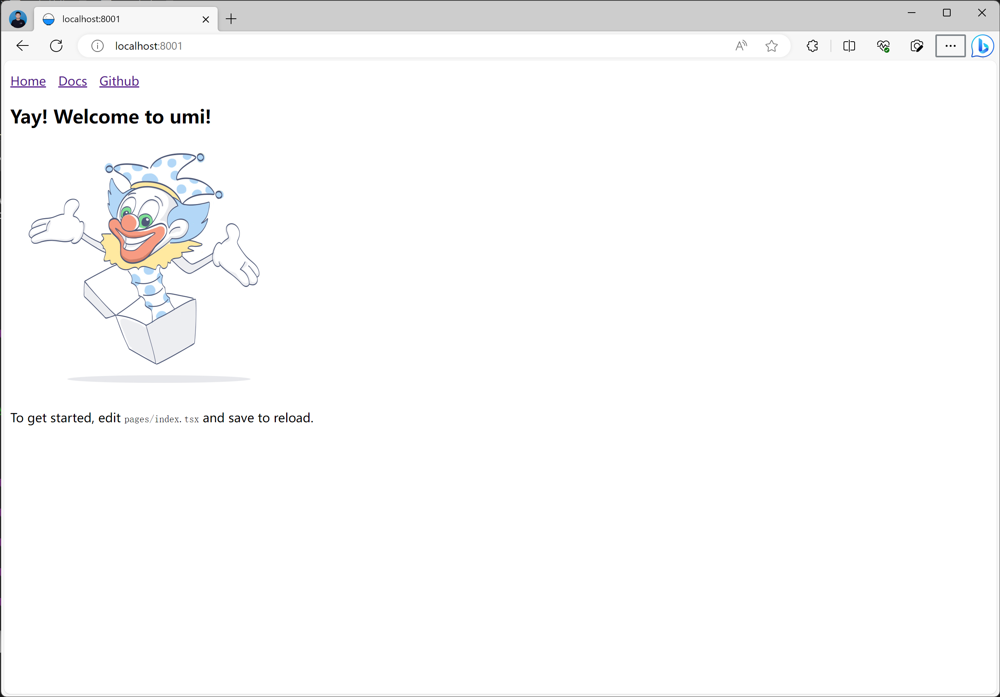
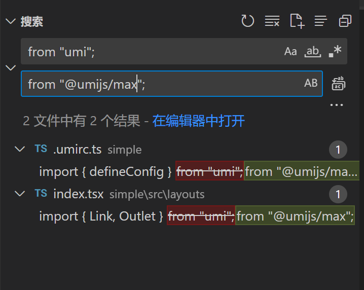

## 一步步搭建一个复杂的项目

## 初始化项目

```shell
npm i pnpm -g

mkdir simple

cd simple

pnpm dlx create-umi@latest

# 这里我们选择 simple 模板
✔ Install the following package: create-umi? (Y/n) · true
✔ Pick Npm Client › pnpm
✔ Pick Npm Registry › taobao
```

### 1. 项目结构

```bash
.
├── config
│   └── config.ts
├── dist
├── mock
│   └── app.ts｜tsx
├── src
│   ├── .umi
│   ├── .umi-production
│   ├── layouts
│   │   ├── BasicLayout.tsx
│   │   ├── index.less
│   ├── models
│   │   ├── global.ts
│   │   └── index.ts
│   ├── pages
│   │   ├── index.less
│   │   └── index.tsx
│   ├── utils // 推荐目录
│   │   └── index.ts
│   ├── services // 推荐目录
│   │   └── api.ts
│   ├── app.(ts|tsx)
│   ├── global.ts
│   ├── global.(css|less|sass|scss)
│   ├── overrides.(css|less|sass|scss)
│   ├── favicon.(ico|gif|png|jpg|jpeg|svg|avif|webp)
│   └── loading.(tsx|jsx)
├── node_modules
│   └── .cache
│       ├── bundler-webpack
│       ├── mfsu
│       └── mfsu-deps
├── .env
├── plugin.ts
├── .umirc.ts // 与 config/config 文件 2 选一
├── package.json
├── tsconfig.json
└── typings.d.ts
```

### 启动项目

```shell
pnpm i

pnpm run start
```

我们会看到



## 增加 layout 功能

首先我们将 umi 替换为 @umijs/max，因为 @umijs/max 是 umi 的增强版，提供了更多的功能，能减少我们很多的配置。

```shell
pnpm i @umijs/max -D
```

然后我们全局替换一下，将 umi 替换为 @umijs/max



然后我们就可以在 umirc,ts 中配置 layout 了

```tsx
{
    layout: {
        name: '长沙学院',
        logo:"https://mdn.alipayobjects.com/huamei_ptjqan/afts/img/A*rsC_RIi8Ms0AAAAAAAAAAAAADkN6AQ/original"
    },
}
```

## umi-presets-pro 功能

umi-presets-pro 提供了 openapi 的功能，这个功能非常重要是我们之后开展 crud 的基础，所以我们要安装这个插件

```shell
pnpm i umi-presets-pro -D
```

之后更新 config.ts 的配置

```tsx
        /**
   * @name 代理配置
   * @description 可以让你的本地服务器代理到你的服务器上，这样你就可以访问服务器的数据了
   * @see 要注意以下 代理只能在本地开发时使用，build 之后就无法使用了。
   * @doc 代理介绍 https://umijs.org/docs/guides/proxy
   * @doc 代理配置 https://umijs.org/docs/api/config#proxy
   */
    proxy: {
      // localhost:8000/api/** -> https://preview.pro.ant.design/api/**
      '/api/': {
        target: 'https://proapi.azurewebsites.net',
        changeOrigin: true,
        pathRewrite: { '^': '' },
      },
    },
  //================ pro 插件配置 =================
  presets: ['umi-presets-pro'],
  /**
   * @name openAPI 插件的配置
   * @description 基于 openapi 的规范生成serve 和mock，能减少很多样板代码
   * @doc https://pro.ant.design/zh-cn/docs/openapi/
   */
  openAPI: [
    {
      requestLibPath: "import { request } from '@umijs/max'",
      // 或者使用在线的版本
      // schemaPath: "https://gw.alipayobjects.com/os/antfincdn/M%24jrzTTYJN/oneapi.json"
      schemaPath: join(__dirname, 'oneapi.json'),
      mock: false,
      projectName: 'ant-design-pro',
    },
    {
      requestLibPath: "import { request } from '@umijs/max'",
      schemaPath:
        'https://gw.alipayobjects.com/os/antfincdn/CA1dOm%2631B/openapi.json',
      projectName: 'swagger',
    },
  ],
```

接下来我们要参考官网文档，逐步增加功能

- 国际化
- 菜单
- curd 表格

## 参考文档

- https://umijs.org/docs/guides/getting-started
- https://ant-design.antgroup.com/components/overview-cn/
- https://pro-components.antdigital.dev/
- https://developer.mozilla.org/zh-CN/docs/Web/JavaScript/Reference/Global_Objects
